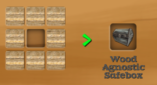
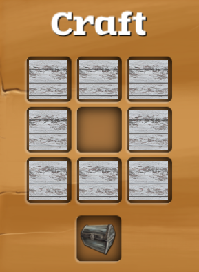
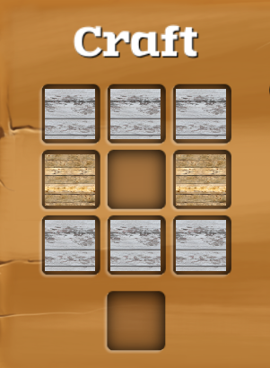
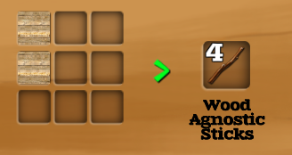
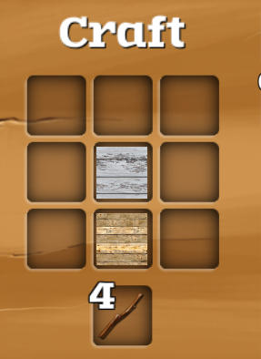
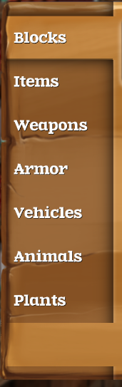

# Guide To Recipe Loader
**Table of Contents:**
- [Definitions](#definitions)
- [Video Demonstration](#video-demonstration)
- [Discovery and Loading](#discovery-and-loading)
- [Required Directive Xml Structure](#required-directive-xml-structure)
- [Element Reference Guide](#element-reference-guide)
- [On Groups](#on-groups)
- [Debugging Recipes](#debugging-recipes)
- [Quirks](#quirks)

 
## Definitions 

0. *Valid .xml file:* A file that has the case sensitive extension ".xml" and passes validation. (I.e, conforms 
  to the requirements and limits set out as per section **RECIPES**)
0. *Valid subdirectory:* A directory that is a direct child of a Content Folder and is named exactly one of:
  - Delete 
  - Replace 
  - Insert 
0. *Content Folder:* A directory named exactly "RecipeLoaderContent".
0. *Priority:* An optional file that is a direct child of a content folder. It must be named "PRIORITY[int number]", where 
  [int number] is a valid integer number. E.g, "PRIORITY25". <br>
  It is used to specify the load order of the Content Folder. <br>
  If there are multiple PRIORITY* files, the one with the highest valid value is chosen. <br>
  Default/Fallback is 10 if there are no valid priority files. <br>
   Higher priority means the contents of that Content Folder take precedence over Content Folders with lower priority.<br>
  Equal priorities may result in unpredictable behavior regarding loading order.

0. *Directive:* A valid .xml file that is a descendant of a Valid subdirectory, up to a maximum depth of 3.

0. *Specifier:* Three elements:
    - name (recipe name="```<name>```"), [Root element]
    - category (category type="```<category>```"),
    - craftstation (craftstation type="```<craftstation>```")
   Used to identify a particular recipe.

0. *Delete directive:* A directive, within a Valid subdirectory, where the name of the subdirectory is "Delete".
   It deletes recipes with the same specifier.

0. *Replace directive:* A directive, within a Valid subdirectory, where the name of the subdirectory is "Replace".
   It replaces recipes with the same specifier with its contents. If there is no recipe with the same specifier, it does nothing.

0. *Insert directive:* A directive, within a Valid subdirectory, where the name of the subdirectory is "Insert". 
   It adds recipes into a station and category as defined in its Specifier.

0. *Overwriting directive:* An Insert directive with the ````<overwrite />```` element present as a descendant of the root.
   It adds recipes into a station and category defined by its Specifier, but also deletes existing recipes with the same Specifier.
   See [Conflict Resolution Rules](#conflict-resolution-rules).

## Video Demonstration

A video going over inserting, replacing and deleting recipes can be found [here](https://youtu.be/0gd1M08BF5c).

## Discovery and Loading
### Discovery
0. The Recipe Loader scans the directory it is in, and the directories below for Content Folders, up to a depth of 5.
0. Each Content Folder is scanned for Valid Subdirectories, which must be direct children.
0. Each Valid Subdirectory is scanned for .xml files, up to a depth of 3, which are attributed to the Content Folder.

### Loading:

0. Content Folders are sorted from lowest priority to highest priority, then iterated over.

  - Each Content Folder:

    - Has their subdirectory xml files validated. Those that pass validation are turned into directives depending on
    the subdirectory they were in.
    - Overwrites conflicting directives from lower priority Content Folders
    - Adds new directives 

1. The directives that remain are then patched into the game.

### Conflict resolution rules:
#### New Delete Directives:
0. Remove lower priority Replace/Insert directives 
0. Are de-duplicated after merging with old.

#### New Replace Directives:
0. Remove lower priority Delete directives 
0. Remove lower priority Replace directives. If those replace directives replaced something, the new recipe directive 
  is also considered to have replaced something (I.e, that directive) and will add its content.
0. Remove lower priority Insert directives. Replace directives that remove an Insert directive are considered to have 
replaced something and will add their content.
0. Are de-duplicated after merging with old.


#### New Insert Directives:
0. Have no special rules. Duplicates are allowed, and are always added unless removed by a newer directive.

#### New Overwriting directives.
0. Remove lower priority Delete directives.
0. Remove lower priority Replace directives.
0. Remove lower priority Insert directives.
0. Duplicates are allowed.

## Required Directive Xml Structure

All directives must have the root element be named ```recipe```, which must have a non-empty ```name``` attribute.

### Deletion Directives 

**REQUIREMENTS:**

0. Element ```category``` with valid ```type``` attribute.
0. Element ```craftstation``` with valid ```type``` attribute.

**Example:**
```
<recipe name="Dig"> <!-- Internal name of the recipe for Stone Pickaxe -->
  <craftstation type="craft" />
  <category type="tools" />
</recipe>
```

### Replace/Insert Directives 

**REQUIREMENTS:**

0. Element ```<category>``` with non-empty and valid ```type``` attribute.
0. Element ```<craftstation>``` with non-empty and valid ```type``` attribute.
0. At least one Element ```<row>```, but no more than:
    - three row elements if craftstation type is a *craft table* or *cauldron*.
    - two row elements if craftstation type is a *furnace*.
    - Out of all rows:
        - There must be at least one ```<item>``` with a non-empty name 
    - In each row:
        - There cannot be more than:
            - three items if craftstation type is a *craft table*
            - one item if craftstation type is a *cauldron* or *furnace*

0. Element ```<result>``` with non-empty ```name``` attribute.
0. **IF** the craftstation is *cauldron* or *furnace*:
    - Element ```<timed>``` with either a non-empty ```seconds``` attribute, or a non-empty ```minutes``` attribute. <br>
      Note that ```minutes``` is not recommended since it refers to the game's definition of a minute, which at the moment 
      is 6 seconds.

**Examples:**
*Craft table recipe:*
```
<recipe name="Inverted Stone Pickaxe">
  <craftstation type="craft" />
  <category type="tools" />

  <!-- When exactCount or count isn't specified, the default is count="1" -->

  <row> <item />                <item name="Stick" /> <item />              </row>
  <row> <item />                <item name="Stick" /> <item />              </row>
  <row> <item name="Stone" />   <item name="Stone" /> <item name="Stone" /> </row>

  <result name="Dig" exactCount="1" /> <!-- "Dig" is the internal name for the stone pickaxe.
                                            See Element Reference Guide for info on 'exactCount' -->
</recipe>
```

*Furnace recipe:*
```
<recipe name="Iron">
  <craftstation type="furnace" />
  <category type="items" />

  <row>  <item name="Gun" exactCount="1" />   </row>
  <row>  <item name="Energy" />               </row>
  <!-- "Energy" is a special in-game name that refers to anything that can be used as fuel. -->

  <result name="Iron Bar" exactCount="1" /> 

  <timed seconds="15" cost="3" /> 
  <!-- cost here is the amount of diamonds to fully skip one of these crafts, defaults to 0 -->

</recipe>
```

*Cauldron recipe:*
```
<recipe name="Alternative Health Potion">
  <craftstation type="cauldron" />
  <category type="items" />

  <row>  <item name="Ruby" />     </row>
  <row>  <item name="water" />    </row> <!-- Yes, it's lowercase. Internal names in this game are very inconsistent. -->
  <row>  <item name="Energy" />   </row>

  <result name="Health Potion" exactCount="1" /> 

  <timed seconds="45" cost="10" /> 

</recipe>
```

## Element Reference Guide
This section contains all the elements and attributes a valid .xml file can have. <br>
This section also includes attributes and elements provided by Recipe Loader. These additional attributes are 
marked via an underline.

Elements and attributes that are always required for insert/replace directives are marked **[REQUIRED]**. <br>
Attributes marked with **[OVERWRITES 'attribute']** take priority over the specified attribute. If the specified attribute
is marked **[REQUIRED]**, the overwriting attribute will fulfil that requirement, and the attribute marked as **[REQUIRED]**
does not need to be specified if the overwriting attribute is present.

Note that delete directives only require a recipe root with a valid name, and both craftstation and category elements with valid
types.

### Cheatsheet:
**Bold** = required, *Italic* = overwrites, ***Bold Italic*** = overwrites a required attribute, ~~Strikethrough~~ = unused 

| Element                                      | Attributes                                                                                 |
|----------------------------------------------|--------------------------------------------------------------------------------------------|
| **recipe**                                    | **name**, hidden, lockedInCreative, hiddenUntilUnlocked, compareIngredientData, ~~mana~~  |
| **craftstation**                              | **type**                                                                                   |
| **category**                                  | **type**                                                                                   |
| ignorethis                                    |                                                                                            |
| overwrite                                   |                                                                                            |
| allowMixed                                    |                                                                                            |
| locked                                        |                                                                                            |
| quest [this or achieve required if locked present]   | **npc**                                                                                   |
| achieve [this or quest required if locked present] | **title**                                                                                  |
| **row**                                           |                                                                                            |
| **item**                                      | **name**, ***group***, count, *exactCount*, data, inheritData, compareData                |
| **result**                                    | **name**, count, *exactCount*, data                                                        |
| timed [required if station is furnace or cauldron] | **minutes**, ***seconds***, cost                                                          |
### ```<recipe>```
**[REQUIRED]** <br>
**Parent:** N/A

Root element. Everything else should be a descendant of this.

#### **Attributes:**

0. **name** **[REQUIRED]** : Specifies the name of the recipe. This is shown in-game underneath the result.
0. **hidden** : If true, this recipe will not appear in the recipe book, but can still be used.
0. **lockedInCreative** : If true, this recipe will not be craftable in creative mode.
0. **hiddenUntilUnlocked** : If true, this recipe will not be visible in the recipe book until it is unlocked.
0. **compareIngredientData** : If true, the "data" attribute will be taken into account for this recipe. A particular
   use case for this is when making recipes involving something like antique spawners.
0. ~~**mana**~~ **[UNUSED]** : This attribute exists in-game, but is unused.


#### Examples:
All the boolean attributes are false by default, a minimal valid recipe element would be:
```
<recipe name="something">
  <!-- Other elements here -->
</recipe>
```

A recipe element with all the toggles enabled:
```
<recipe name="Goodbye World!" hidden="true" lockedInCreative="true" hiddenUntilUnlocked="true" compareIngredientData ="true">
  <!-- Other elements here -->
</recipe>
```

### <u>```<craftstation>```</u>
**[REQUIRED]** <br>
**Parent:** recipe 

Contains the type of station the recipe is for.

#### Attributes

0. **type** **[REQUIRED]** : Specifies the station. Valid input is the following (case in-sensitive)
  - **Craft Table**: (3 x 3 grid. If your recipe can fit in a 2x2 grid, it can be made in the inventory) <br>
    1. *craft*
    0. *craftable*
    0. *crafttable*
    0. *craft_table* 
    0. *crafting_table*

  - **Furnace**: (2 rows x 1 column grid. timed element required)

    1. *furnace*
  - **Cauldron**: (3 rows x 1 column grid. timed element required)

    1. *cauldron*

#### Examples
**Craft Table:**

```
<recipe <!-- attributes... --> >
  <craftstation type="craft" />

  <!-- Rest of recipe ... -->
</recipe>
```

```
<recipe <!-- attributes... --> >
  <craftstation type="crafting_TABLE" />

  <!-- Rest of recipe ... -->
</recipe>
```

**Furnace:**

```
<recipe <!-- attributes... --> >
  <craftstation type="furnace" />

  <!-- Rest of recipe ... -->
</recipe>
```

**Cauldron:**

```
<recipe <!-- attributes... --> >
  <craftstation type="cauldron" />

  <!-- Rest of recipe ... -->
</recipe>
```

### <u>```<category>```</u>
**[REQUIRED]** <br>
**Parent:** recipe 

Contains the type of category the recipe is for.

#### Attributes

0. **type** **[REQUIRED]** : Specifies the category. Valid input is the following (case in-sensitive). <br>
  Optional characters are denoted by (x):

    -  *block(s)*<br>
    -   *item(s)*<br>
    -   *weapon(s)*<br>
    -   *tool(s)*<br>
    -   *armor(s)*<br>
    -   *animal(s)*<br>
    -   *plant(s)*<br>
    -   *vehicle(s)*<br>
    -   *food(s)*<br>
    -   *hide* -- Note that this category makes the recipe not visible in the recipe book.

#### Examples 

Tools:

```
<recipe <!-- attributes... --> >

  <category type="tool" />

  <!-- Rest of recipe ... -->
</recipe>
```

Blocks:

```
<recipe <!-- attributes... --> >

  <category type="BLOCKS" />

  <!-- Rest of recipe ... -->
</recipe>
```

Hide:

```
<recipe <!-- attributes... --> >

  <category type="hide" />

  <!-- Rest of recipe ... -->
</recipe>
```

### <u>```<ignorethis>```</u>
**[OPTIONAL]** <br>
**Parent:** recipe 

If this element is present, this recipe will be ignored by Recipe Loader.

#### Attributes

None.

#### Examples 

```
<recipe <!-- attributes... --> >

  <ignorethis />

  <!-- Rest of recipe ... -->
</recipe>
```

### <u>```<overwrite>```</u>
**[INSERT DIRECTIVES ONLY]** **[OPTIONAL]** <br>
**Parent:** recipe 

If this element is present, this recipe will be added, and remove all other recipes with the same specifier. Does nothing 
in Replace directives.

#### Attributes

None.

#### Examples 

```
<recipe <!-- attributes... --> >

  <overwrite />

  <!-- Rest of recipe ... -->
</recipe>
```


### <u>```<allowMixed>```</u>
**[OPTIONAL]** <br>
**Parent:** recipe 

If this element is present, the recipe will allow item slots sharing groups to contain any combination of items 
from those groups, instead of requiring that they are all the same item from the group.

Do note that this can drastically increase the amount of recipes that may be generated.

#### Attributes 

None.

#### Examples 

```
<recipe <!-- attributes... --> >

  <allowMixed />

  <!-- Rest of recipe ... -->
</recipe>
```


### ```<locked>```
**[OPTIONAL]** <br>
**Parent:** recipe

This element forces the recipe to require being unlocked from an achievement or quest before being usable. <br>
Must contain either a single ```<quest>``` or element ```<achieve>``` with their required attribute. <br>
Note that the quest/achieve elements are not responsible at all for defining how the recipe is unlocked. This is because
the achievements and quests themselves are responsible for unlocking recipes. You can think of the achieve and quest 
elements more as hints to the player to tell them where to unlock this from.

#### Attributes 

None.

#### Examples 

```
<recipe <!-- attributes... --> >

  <locked>

  <!-- <quest npc="InternalNpcName" /> -->
  
  <!-- OR -->

  <!-- <achieve title="NameOfAchievement" /> -->

  </locked>

  <!-- Rest of recipe ... -->
</recipe>

```
### ```<quest>```
**[REQUIRED*]** <br>
\*Either this or ```<achieve>``` is required if locked is present. <br>
**Parent:** locked 

Specifies that the hint in the recipe book for unlocking this recipe should take the form of:
<pre>
"Complete quest from {quest.npc} to unlock."
</pre>

#### Attributes 

0. **npc** **[REQUIRED]** : Specifies the name of the NPC. If it matches an internal mob name, it will use the name of 
  that mob. Otherwise, the text here will be used.

#### Examples 

```
<recipe <!-- attributes... --> >

  <locked>

  <quest npc="ShadowHunter" /> <!-- Internal name for the Alchemist -->
  
  </locked>

  <!-- Rest of recipe ... -->
</recipe>
```

### ```<achieve>``` 
**[REQUIRED\*]** <br>
\* Either this or ```<quest>``` is required if locked is present. <br>
**Parent:** locked 

Specifies that the hint in the recipe book for unlocking this recipe should take the form of:
<pre>
"Complete achievement {achieve.title} to unlock."
</pre>

#### Attributes 

0. **title** **[REQUIRED]** : Specifies the name of the achievement. The text here is displayed as-is.

#### Examples 

```
<recipe <!-- attributes... --> >

  <locked>

  <achieve title="Some Tedious Achievement" />
  
  </locked>

  <!-- Rest of recipe ... -->
</recipe>
```

### ```<row>```
**[REQUIRED]** <br>
**Parent:** recipe 

Specifies a row of items. You need at least one row with one named item.

You can have:

  - 3 Rows with 3 items each if your craftstation is a craft table
  - 2 Rows with 1 item each if your craftstation is a furnace
  - 3 Rows with 1 item each if your craftstation is a cauldron

#### Attributes 

None.

#### Examples 

```
<recipe <!-- attributes... --> >

  <row>

  <!-- <item> elements go here -->
  
  </row>

  <!-- Rest of recipe ... -->
</recipe>
```


### ```<item>```
**[REQUIRED]** <br>
**Parent:** row 

Specifies an item slot. You need at least one item with the name or group attribute set.

Item slots are ordered:

0. Leftmost 
0. Middle 
0. Rightmost

**WARNING!** All your item elements must fit in the minimal bounding box that contains your item elements with names/groups. <br>
See [Quirks](#quirks), Section Item Grid for more information.

#### Attributes 

  0. **name** **[REQUIRED\*]** : Specifies the internal game name of the item to be used in this slot. An ```<item>```
    without a name attribute is an empty slot. <br>

  0. <u>**group**</u> **[OVERWRITES name]** : Specifies what group this item slot should accept. Invalid groups result in the
    recipe producing an error. The item that appears in this slot will be the first item of the group, though 
    other items in the group will also be accepted for this slot. See [Group List](./GROUP-LIST.md) for a list of 
    valid groups.

  0. **count** **[DEFAULT: 1]** : Specifies the "count" value, which depends on what the item is. For items that don't 
    have any durability, like blocks, this will refer to the amount of those blocks. For items that have durability 
    such as tools or armor, this will refer to the amount of durability from those items.

  0. <u>**exactCount**</u> **[OVERWRITES count]** : Specifies the actual amount of items, regardless of whether it is something
    with durability or not. For example, a pickaxe with an exactCount of 1 will mean "1 full pickaxe".
  
  0. **data** **[DEFAULT: 0]** : Specifies the data parameter for the item. What this does depends on the item. E.g, for
    Antique Spawners it specifies their mob.

  0. **inheritData** : If true, the resulting item in ```<result>``` will have the same data value as the ingredients with inheritData.
    This is most notably used for items like windows and glass. <br>
    **NOTE:** The way the game handles inheritData at the moment is awkward. The result item will only have the same 
    data value as the **first** found inheritdata item, which means for example, if you have four glass blocks with 
    inherit data, and the player uses a glass block with a data value that makes it green, with the other three 
    glass blocks having data that makes it red, the result item might have data from the green block depending
    on its location in the recipe! The upper left-most item takes priority for inheritData.<br>
    **WARNING:** Enabling compareIngredientData in ```<recipe>``` will not fix the above issue because this will require you to 
    hardcode data values for items using data in your recipe, which defeats the purpose of inheritData.

  0. ~~**compareData**~~ **[UNUSED]** : This attribute exists in-game, but is unused.

#### Examples 

A set of rows and items that creates a "+" recipe shape

```
<recipe <!-- attributes... --> >
<craftstation type="craft" /> <!-- 3 x 3 grid -->

  <row>     <item />             <item name="Bark" />             <item />    </row>
  <row>     <item name="Bark" /> <item name="Bark" /> <item name="Bark" />    </row>
  <row>     <item />             <item name="Bark" />             <item />    </row>

  <!-- Rest of recipe ... -->
</recipe>
```

A safebox-like recipe, except you can use any kind of plank as long as it's the same variety for each slot.

```
<recipe <!-- attributes... --> >
<craftstation type="craft" /> <!-- 3 x 3 grid -->

  <row>     <item group="Plank" />   <item group="Plank" />   <item group="Plank" />   </row>
  <row>     <item group="Plank" />   <item />                 <item group="Plank" />   </row>
  <row>     <item group="Plank" />   <item group="Plank" />   <item group="Plank" />   </row>

  <!-- Rest of recipe ... -->
</recipe>
```


A recipe that uses 5 durability from a stone hammer and 1 sandstone block <br>
NOTE: This recipe would be craftable in the inventory, and it doesn't matter what slots Sand Stone and Hammer 
are on, as long as Hammer is directly to the right of Sand Stone

```
<recipe <!-- attributes... --> >
<craftstation type="craft" /> <!-- 3 x 3 grid -->

  <row> <item name ="Sand Stone" /> <item name="Hammer" count="5" /> </row>

  <!-- Rest of recipe ... -->
</recipe>
```

A recipe that always uses 1 full hammer.
NOTE: This recipe would be craftable in the inventory, and it doesn't matter what slots Sand Stone and Hammer are on
as long as Hammer is directly on top of Sand Stone

```
<recipe <!-- attributes... --> >
<craftstation type="craft" /> <!-- 3 x 3 grid -->

  <row> <item name="Hammer" exactCount="1" /> </row>
  <row> <item name ="Sand Stone" />           </row>

  <!-- Rest of recipe ... -->
</recipe>
```

A modified in-game recipe that uses inheritData:

```
<recipe <!-- attributes... --> >
<craftstation type="craft" /> <!-- 3 x 3 grid -->

  <row> <item name ="Candle" inheritData="true" /> </row>
  <row> <item name="Dragon Helmet" exactCount="1" /> </row>
  <!--
  Interestingly, the actual in-game recipe doesn't specify a count for Dragon Helmet, so the actual recipe for this
  that's in the game right now only takes away one point of durability from it to make a mining helmet.
  This recipe would use the full helmet instead.
  Remember to specify count/exactcount when dealing with tools!
  -->

  <!-- Rest of recipe ... -->
</recipe>
```

### ```<result>```
**[REQUIRED]** <br>
**Parent:** recipe

Specifies what the recipe produces.

#### Attributes 

  0. **name** **[REQUIRED]** : Specifies the internal game name of the item to be made from this recipe.

  0. **count** **[DEFAULT: 1]** : Specifies the "count" value, which depends on what the item is. For items that don't 
    have any durability, like blocks, this will refer to the amount of those blocks. For items that have durability 
    such as tools or armor, this will refer to the amount of durability from those items.

  0. <u>**exactCount**</u> **[OVERWRITES count]** : Specifies the actual amount of items, regardless of whether it is something
    with durability or not. For example, a pickaxe with an exactCount of 1 will mean "1 full pickaxe".
  
  0. **data** **[DEFAULT: 0]** : Specifies the data parameter for the item. What this does depends on the item. E.g, for
    Antique Spawners it specifies their mob.


### ```<timed>```
**[REQUIRED\*]** <br>
\*Required if the station is Cauldron or Furnace. <br>
**Parent:** recipe

Specifies the time required for the recipe to complete, alongside the cost to speed it up.

#### Attributes 

0. **minutes** **[REQUIRED]** : Specifies how long the recipe should take to complete. <br>
   **WARNING:** This name is extremely misleading. Each "minute" actually corresponds to 6 seconds. <br>

0. <u>**seconds**</u> **[OVERWRITES minutes]** : Can be used instead of minutes. <br>
   This name is accurate and each unit of "seconds" is an actual second.

0. **cost** **[DEFAULT : 0]** : Specifies the diamond cost to skip one craft of this recipe. Default is 0,
   meaning players will be able to skip this recipe for free if you don't specify it.

   
#### Examples

```
<recipe <!-- attributes... --> >
<craftstation type="furnace" /> 

  <!-- Some recipe row and items -->

  <timed minutes="5" cost="15" />
  <!-- This recipe will take 30 seconds to complete, and cost 15 diamonds to skip fully. -->

</recipe>
```

```
<recipe <!-- attributes... --> >
<craftstation type="cauldron" /> 

  <!-- Some recipe row and items -->

  <timed seconds="10" cost="15" />
  <!-- This recipe will take 10 seconds to complete, and cost 15 diamonds to skip fully. -->

</recipe>
```

## On Groups 

Current list of available groups is [available here](./GROUP-LIST.md).
Probably one of the more useful features Recipe Loader provides is allowing you to make recipes with slots that can 
contain any item from a group.

Take this recipe for example:

```
<recipe name="Wood Agnostic Safebox">
  <craftstation type="craft" />
  <category type="tools" />


  <row> <item group="Plank" />   <item group="Plank" /> <item group="Plank" /> </row>
  <row> <item group="Plank" />   <item />               <item group="Plank" /> </row>
  <row> <item group="Plank" />   <item group="Plank" /> <item group="Plank" /> </row>

  <result name="Safebox" exactCount="1" />

</recipe>
```

In-game, it would appear like this:



This is the "canonical" representation of the recipe, which is made up of the first element in each group. <br>
You may also notice that the recipe name is a grey color. This acts as an indicator that the recipe uses groups 
without ```<allowMixed />```.

When crafting this recipe, you are able to use any type of plank, as long as they are consistent:



If they were inconsistent, the crafting recipe would fail:



For recipes without as many item slots with groups, the ```<allowMixed />``` element exists to make the recipe 
accept inconsistent types. Consider the following example:

```
<recipe name="Wood Agnostic Sticks">
  <craftstation type="craft" />
  <category type="tools" />

  <allowMixed />


  <row> <item group="Plank" /> </row>
  <row> <item group="Plank" /> </row>

  <result name="Stick" exactCount="4" />

</recipe>
```

Which appears as:



The name of this recipe is **black** instead of grey, which indicates that this recipe uses ```<allowMixed />```.

Which allows:





Be careful when using ```<allowMixed />```, as it can cause a very large amount of hidden recipes to be generated.

The example below:
```
<recipe name="Wood Agnostic Crafting Table">
  <craftstation type="craft" />
  <category type="tools" />

  <allowMixed />


  <row> <item group="Plank" /> <item group="Plank" /> </row>
  <row> <item group="Plank" /> <item group="Plank" /> </row>

  <result name="Craft Table" exactCount="1" />

</recipe>
```

Would generate 624 hidden recipes (5^4 - 1 for canonical, the base is the amount of items in the group, which is 5 as of 2026-08-15).

The example below:
```
<recipe name="Wood Agnostic Safebox">
  <craftstation type="craft" />
  <category type="tools" />

  <allowMixed />


  <row> <item group="Plank" />   <item group="Plank" /> <item group="Plank" /> </row>
  <row> <item group="Plank" />   <item />               <item group="Plank" /> </row>
  <row> <item group="Plank" />   <item group="Plank" /> <item group="Plank" /> </row>

  <result name="Safebox" exactCount="1" />

</recipe>
```

Would generate 390624 hidden recipes (5^8 - 1 for canonical). Recipes of this scale aren't supported and 
trying to do this will log an error without expanding the recipe, unless you want to change the configuration 
and find out why it's not trying to expand it. (Hint: It's because the game would freeze and start eating your memory)

## Debugging Recipes

If your recipe doesn't work as expected or doesn't show up in-game, check the ```LogOutput.log``` file in the BepInEx 
directory. The validator will print any errors that make the xml unusable, and also any warnings that you might 
want to know about.

## Quirks

### ```<timed>``` A "minute" is 6 seconds 

Not much else to say about this. A minute is 6 seconds. Please use the 'seconds' attribute instead.

A shortcut was apparently taken during development as seen in the game's ```RecipeManager.parse(TextReader)```, as 
the input minutes are multiplied by a "0.1" constant. 

### Item Grid

For a recipe to be valid in-game, it needs to be structured in a surprisingly strict manner. This section will be 
using the 3 x 3 grid of the craft table to demonstrate this.

Imagine the 3x3 grid like this, where "[]" and "\<\>" represent rows, and "N", "O", "X" represent the types of items.

```
[ X X N ]     | Legend:
[ X O N ]     | X = non-empty item  N = item not specified  [ ... ] = Row
< N N N >     | O = empty item                              < ... > = Row not specified
```

In our .xml file, this could map to:

```
<row> <item name="Plank" /> <item name="Plank" /> </row>
<row> <item name="Plank" /> <item />              </row>
```

This set of rows and items would be valid. Notice that if we were to draw a **box** around the grid that contains 
all of the "X" items:

```
   _______
[ | X   X | N   ]
[ |_X___O_| N   ]
<   N   N   N   >
```

All the items within the box are either an "X" or "O" (Good!), and all the items outside the box are "N", items that aren't defined.
 (Also good!)

This is what you need to keep in mind when making recipes.

Consider the following examples:

```
[ X X O ]
[ X N N ]
[ X X O ]
```

The above recipe might map to something like:
```
<row> <item name="Bark" /> <item name="Bark" /> <item /> </row>
<row> <item name="Bark" />                               </row>
<row> <item name="Bark" /> <item name="Bark" /> <item /> </row>
```

Drawing the imaginary box around the "X" elements:
```
   ________
[ | X   X | O   ]
[ | X   N | N   ]
[ |_X___X_| O   ]
```

You can see that there are "N"s inside the box (Bad!), and "O"s outside the box (Also bad!). This recipe is invalid. If Recipe Loader 
did not check for this, giving a recipe with items like this to the game would either cause that category for that 
crafting station to break and no longer be visible in the recipe book, OR the recipe would **be** visible in the recipe book 
but **unusable**.



To make it valid, we just need to make sure that all items outside the bounding box are "N", not specified, and all 
items inside the bounding box are either "X" (named items) or "O" (empty items).  <br>
The fixed and working example would be:

```
<row> <item name="Bark" /> <item name="Bark" /> </row>
<row> <item name="Bark" /> <item />             </row>
<row> <item name="Bark" /> <item name="Bark" /> </row>
```

Which in our grid notation would look like:
```
   ________
[ | X   X | N   ]
[ | X   O | N   ]
[ |_X___X_| N   ]
```


